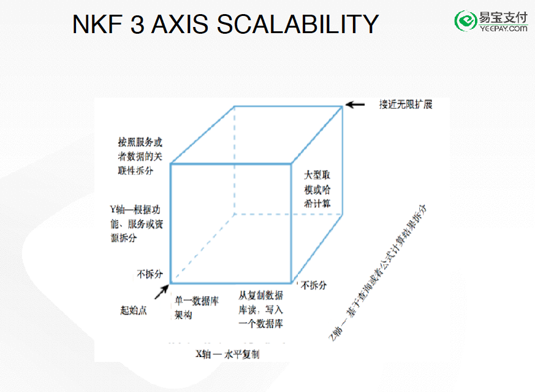
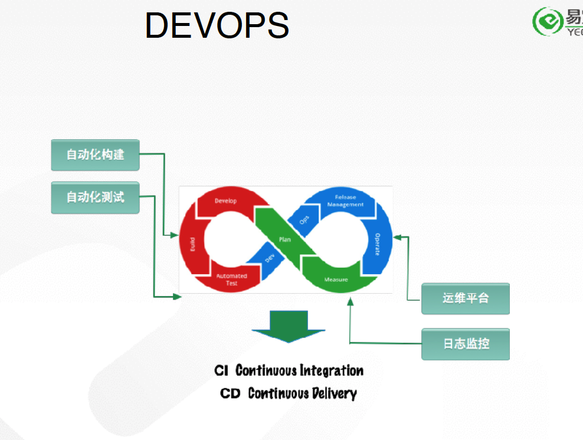
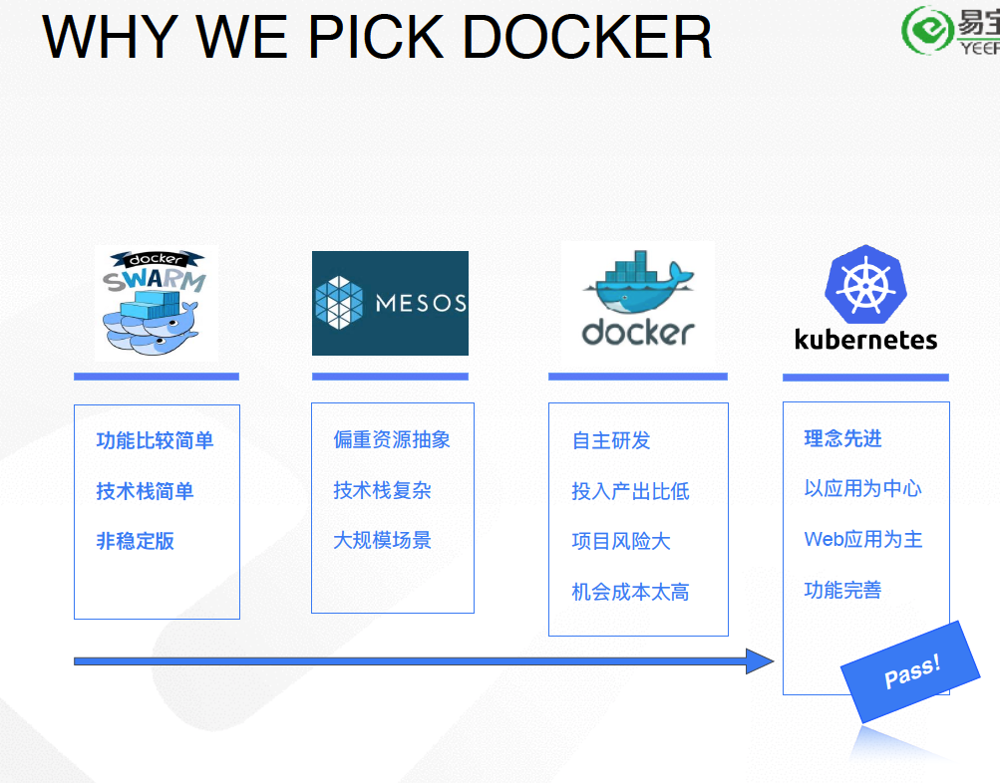
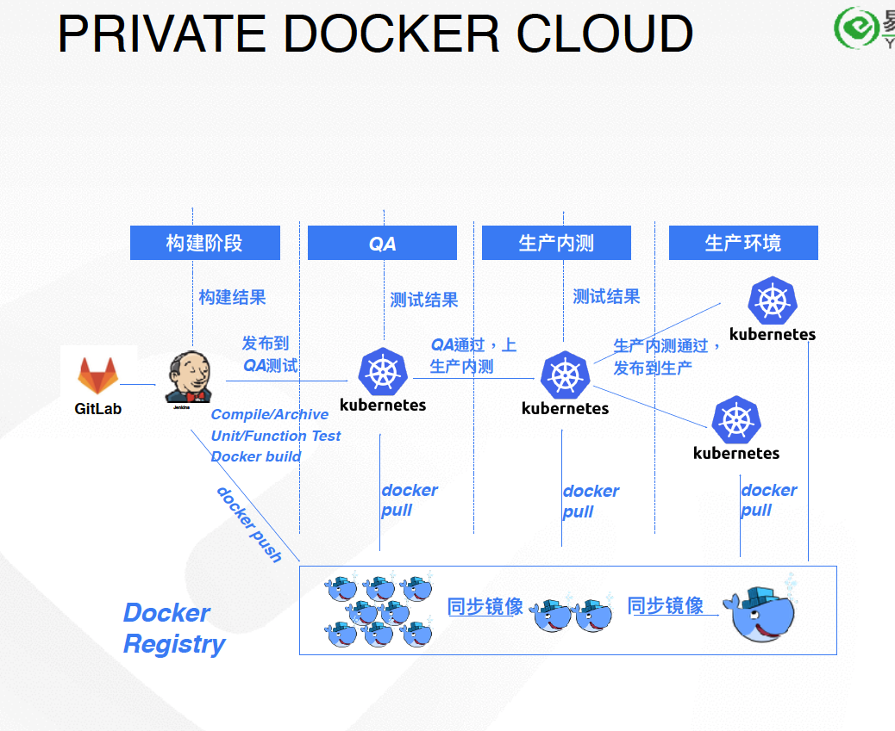
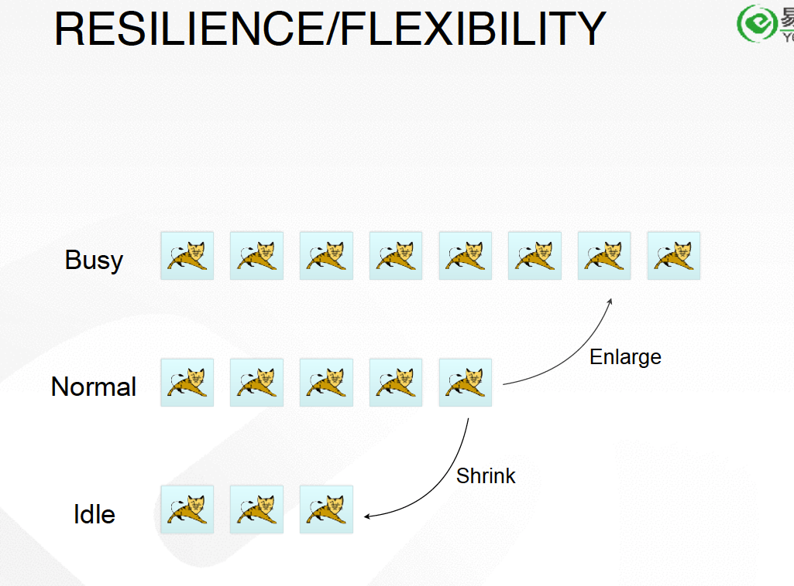

[⬅ Modern Web 2017](https://hackmd.io/KwFgRsAMAcCMCmBaaA2AnAJkeFlEEMMMBmZdAMzDRTHMkliA?view)

[投影片](http://s.itho.me/modernweb/2017/day2/201-4-%E9%99%B3%E6%96%8C.pdf)

# 如何構建基於容器雲的大型支付交易平臺

###### tags: `ModernWeb2017`
The Evolution of Large Scale Payment Platform

Payment Transaction Platform:
Availability, Security, Efficiency

## Characteristics of Payments
- Availability: 7 * 24 * 365 (多了7不是很奇怪嗎？？ 通常只會說 7 * 24 ，他意思應該是真的很穩的意思？)
- Security: PCI-DSS, ISO27000
- Efficiency: low cost
- Compared with other platforms (such as social media) need to be more efficient.etc

## Evolution of the platform
2003~2013年，使用F5當作node balance(?)
2013年，改用Nginx
ibm是乾爹

## The Scale Cube - 因為規模變大，系統達到拆分的時機

[microservices.io - scalecube](http://microservices.io/articles/scalecube.html)

- X-Application Duplication(機械不斷的複製)
- Y-Service Decomposition
- Z-Data Separation(數據不斷地拆分)

機械拆分之後，遇到了更多的問題，拆分之後發現機械超多，每個機械有自己的環境
不同還就又有它自己的設定，版本、系統架構、代碼的複雜性，使得維運更加困難。

## 維運遇到的挑戰
- 人員的失誤
- 無聊的設定
- 複雜的硬體設定/設備

### 因此為了麻煩的教育訓練，為了加快速度，我們決定開始自動化，而這也跟DEVOPS不謀而合
- 自動化 routine work:
	- Coding -> Testing -> Integration -> Deployment -> Monitoring

- DEVOPS

## 為什麼我們選擇了Docker

## ARCHITECTURE OF THE CLOUD

Monitoring : 根據健康檢查得出的結論

## RESILIENCE/FLEXIBILITY
> Docker可以自動去增加Tomcat，非常有彈性，靈活性很高
> 忙的時候會自己增加好幾隻[貓]，不忙的時候[貓]會自己藏起來)

