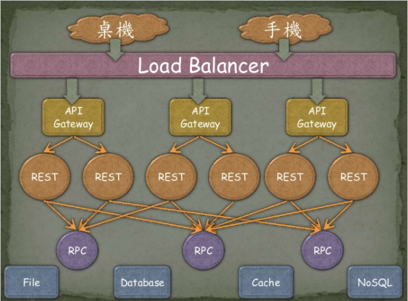
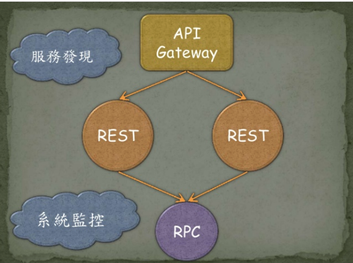
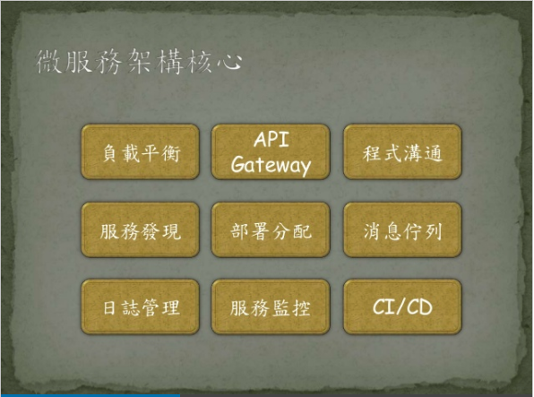

[⬅ Modern Web 2017](https://hackmd.io/KwFgRsAMAcCMCmBaaA2AnAJkeFlEEMMMBmZdAMzDRTHMkliA?view)
# 用 Go 語言打造微服務架構

> ###### tags: `ModernWeb2017`
> GoLang微服務

## Monolithic
### 優勢
- 集中管理
- 開發簡單
- 容易上手
- 除錯簡單
- 單一主機

專案複雜，團隊成長 => 專案變多

### 缺陷
- 開發效率低 => 需解決分支衝突
- 不易維護 => colding style不同
- 不易開發
- 穩定性差 => 人 和 bug 互相影響
不易擴充 => 效能瓶頸 => 為了增加效能做調整（負載平衡） => 維運成本增加 => 部署時間變長

--- 

## 微服務核心架構
> 會後有朋友問到，現在全部的功能都寫在一起，怎麼知道哪些功能可以拆出來當作微服務。在會議上我提到了底下幾點給大家參考:

- 依照業務區分
- 自動化部屬
- 高度容錯
- 可快速置換 (ex. 部分功能更換語言)
- 可獨立開發
- 容易擴充

### 適合敏捷開發
需求 -> 開發 -> 測試 -> 部屬 -> 上線 -> 需求 -> ...

### UI/UX
使用者體驗

### 作者的經驗
- 如果很多專案都需要共用一個功能或需求，那就是可以拆出來
- 舉例來說：
	- 每個專案都需要後端伺服器串接 Google FCM 或 Apple 來發送手機訊息，這部分就可以直接拆成一個微服務，專門發送手機訊息。
	- 只要寫一次，就可以讓多個專案同時支援，當然服務跟服務之間的溝通方式要事先定好。

---
## 微服務事前準備
- 快速建置 (Develop)
- 監控機制 (Monitor)
- 快速部署 (Deploy)

準備微服務前，請先有**內部系統監控機制**，以及 **CI/CD 的串接**，讓開發者可以專心開發，不用擔心部署問題，

另外**由於微服務肯定會越來越多**，所以**一定要監控每個服務，達到機器管理機器**，而不是增加人力去管理越多台服務，而在導入初期肯定無法完全做到，還是需要一些人為操作，但**最終還是要全部自動化**。

--- 

## 導入微服務代價

- 系統複雜度提升
- 系統資料一致性
- 維運工作複雜化

導入微服務並不是只有優點，也是有很多代價的，**除非有強大的 DevOps 團隊**，否則當服務越來越多，系統複雜度提高，維運工作只會越來越複雜的。

## 實現微服務架構 (GO lang)

### 負載平衡： 
[Caddy](https://github.com/mholt/caddy) / seesaw /Nginx

### API GateWay： 
[Træfik](https://traefik.io/) / tyk / fabio

### 微服務溝通：
REST / RPC / 其他

### REST框架：
- Gin
- kit
- micro
- kite
- each
- goa
- Beego

### RPC框架： 
- [gRPC](http://grpc.io) [google 內部使用，其雲端也有支援](https://opensource.google.com/projects/grpc)
- thrift
- hprose

#### 溝通格式
- Json (本次不提)
- Protobuf (可以把它想像成是 XML 或 JSON 格式，但是更小、更快，而且更簡潔。)
[protobuf參考](https://yami.io/protobuf/)

### 服務發現
- etcd
- consul
- serf

### 分散式系統：
- Swarm
- k8s

### 消息佇列：
- NSQ
- nats
- [Gorush](https://github.com/appleboy/gorush)  講師維護開發

### 日誌分析：
beats + elastic + grafana

### 服務監控：
- open-falcon
- prometheus

### CI/CD 部署：
- Drone
- Concourse
    - 2017 iT邦幫忙鐵人賽 [不一樣的 CI/CD 工具：Concourse 初探](http://ithelp.ithome.com.tw/users/20065771/ironman/1020)

#### 沒有CI/CD請誤導入微服務

## Golang 部屬流程
coding -> testing -> 發佈 -> 上傳 -> 通知

### 典型Pipeline 流程(Go 語言)
- 測試程式碼
- 分析程式碼
- 驗證程式碼品質
- 編譯 go Binary
- 上傳 Binary 到 github
- 編譯 Docker Image (build stage)
- 打包 final stage
- 上傳到 Docker Hub
- 部署 Docker Container
- 通知訊息
 
## Golang 語言優點
講者的同時下幾百台ssh命令的外掛： (使用 sync and channel)
https://github.com/appleboy/drone-ssh

## 為什麼使用GO
- 老爸是google
- 執行效率 
  - 開發 
  - 維護
- 學習曲線 
  - 類Ｃ語言 
  - 編譯快速
- 部署效率 
  - 交叉編譯 
  - 無依賴部署
- 代碼規範 
  - 編譯檢查 
  - 統一工具

## 參考專案
### Gorush: A push notification server
[gorush](https://github.com/appleboy/gorush)

### Go Orm:
[xorm](https://github.com/go-xorm/xorm)