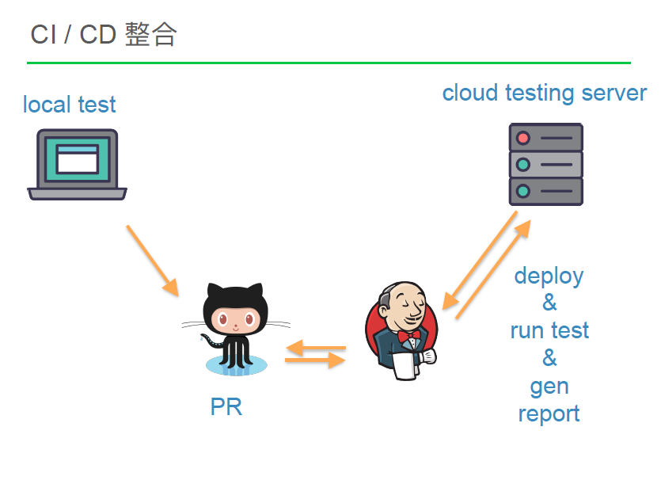

# Modern Web 2017
## 聽過的議程
8/11

- The evolution and the future of the web - 北村英志(Eiji Kitamura)
- Bots and AI - Future of the Web with Conversational Interface - 井村友美(Tomomi Imura) , Slack , Developer Relations Manager
- GraphQL + Relay 試玩心得 —— 串起前端與後端的資料橋樑 - 張博凱(zetavg)
- Gogolook 動物園自動化測試藴育之旅 - 尤俊凱(Eric Yu)
- 企業 App 開發的普適架構 - Web 前端搭配既有後台 - 許精一(Jambo Hsu)
- 用 Go 語言打造微服務架構 - 吳柏毅(Appleboy)
- Designing Scalable ORM for PHP - 林佑安(c9s)

8/12

- Modern Web Architecture Design Journey - 曾義峰(Ant)
- Hiiir百人開發團隊導入敏捷開發實踐經驗 - 李佳憲(Neil Lee)
- Docker + CI pipeline 的高效率 ChatBot 開發方法 - 鄭淳尹(Philipz)
- Snapshot Everything - 從元件測試點燃新一代測試觀念 - 卓承賢(Aaron 小狂)
- 如何打造自己的PWA - 鐘恒
- 統一內容-閱文集團內容系統統一與整合 - 徐海峰(大嘴)
- 如何構建基於容器雲的大型支付交易平臺 - 陳斌(Chuck)

## 印象深刻的議程

# Bots and AI - Future of the Web with Conversational Interface - 井村友美(Tomomi Imura) , Slack , Developer Relations Manager
[投影片](https://hackmd.io/IYE2DMCYGZwNgLQGMAsBWRKkjQgRqOAiAAwhx6RIAceApg0A)

- 介紹相關產品 (p1 ~ p14)
- 圖形介面 轉成 Conversational Interface (對話介面)
- 對話介面特點：
	1. 模擬真人互動的詞句，配合最少的視覺畫面互動 - 去除UI雜訊、省時 (p18~20) 
	2. siri其實就有做到
	3. 優點：直接、無障礙、產品化 (p25)
- Messaging platforms (26)
	- FB Messenger 
	- Slack
- Chatbot Building APIs (31)
- Alaas (artificial intelligence as a Service)(人工智慧服務) (p32)
- NLP & Conversational platforms / APIs (p34)
	- IBM Watson / Google Cloud Natural Language API / ... 
- Build Your Own Conversational Interface With JS (p35)
	- API.ai + FB Messenger (p38)
	- IBM Watson + Slack
		- workflow (另外搭配 Raspberry Pi的小機器人，上面有ＬＥＤ燈) (p41~p46) - 分析詞句的感情，顯示對應的燈光顏色(生氣是紅色)
- Conversational Interface with Voice In Browser (p47~p53)
	- voice -> Text
	- Text 輸入 NLP API for AI 做分析
	- Text -> Synthetic Voice
- Web Speech API (p49~p52)
- 架構 (p53)
- Demo: [webspeech](https://webspeech.herokuapp.com/)

---

# GraphQL + Relay 試玩心得 —— 串起前端與後端的資料橋樑 - 張博凱(zetavg)
[投影片](https://speakerdeck.com/zetavg/graphql-and-relay-nil-chuan-qi-qian-hou-duan-shi-jie-de-qiao-liang)

[下載點](https://www.dropbox.com/s/354fqr6gnadume4/GraphQL%20&%20Relay%20%EF%BC%8D%20%E4%B8%B2%E8%B5%B7%E5%89%8D%E5%BE%8C%E7%AB%AF%E4%B8%96%E7%95%8C%E7%9A%84%E6%A9%8B%E6%A8%91%20@Modern%20Web%202017.pdf?dl=0)

- 投影片介紹的很詳細，看完可暸解內容
- 我同事分享實作GraphQL的心得，對於relationship DB而言，會花很多時間在後端處理 多表格 join 的過程，若是 No-sql 應該會蠻好用的

---

# Gogolook 動物園自動化測試藴育之旅 - 尤俊凱(Eric Yu)
[投影片](./Modren_Web/Gogolook_動物園⾃動化測試藴育之旅.pdf)

- 舉例：有 UI / service / Unit test 3 layer , test cover 在 service / Unit test 這2 layer , UI layer 很少

- 希望web導入UI 自動化測試
- UI Testcase
	- 定義範圍：use User Story
- 制定流程 (p16)
	- 環境安裝: Node
	- Git / Github
	- CSS Selelctor 
	- E2E Testing 的 CI/CD flow
- CSS Selector 練習 ：[https://flukeout.github.io/](https://flukeout.github.io/)
- How to copy Selector : [https://stackoverflow.com/a/45078286](https://stackoverflow.com/a/45078286)
	- browser.click("body > div.site-container > header > div > nav > div > ul > li.showcard > a")

### 網頁自動化測試工具：
http://webdriver.io/

- 跟網⾴⼀樣使用 CSS selector 選擇元素
- 入⾨ JavaScript 的難度相對較低
- 可以透過撰寫 synchronous 的 command 來執⾏ asynchronous 的⾏為，所以可以不必⾃行 handle Promise 的問題

### JS Test Framework
mocha

### 持續整合（Continuous integration)
Jenkins

### Cloud Testing 
[線上browser testing 平台比較](https://stackshare.io/stackups/browserstack-vs-sauce-labs-vs-testingbot)

[Xamarin Test Cloud Mobile app testing ](https://www.xamarin.com/test-cloud)

[北科大做的 andriod Cloud Testing ](http://pl.csie.ntut.edu.tw/ctpintro/)

#### Demo
[testingbot Demo](https://www.youtube.com/watch?v=87M2pXEmtnU&feature=youtu.be)

#### Refs
- [TestPyramid](https://martinfowler.com/bliki/TestPyramid.html)
- [狠狠地聊⼀一下UI⾃自动化测试](http://www.jianshu.com/p/0fc9fc5f42e9)
- [無痛網站⾃自動化測試](http://www.ithome.com.tw/video/108429)

---

# 用 Go 語言打造微服務架構 - 吳柏毅(Appleboy)
[作者的Blog，含投影片](https://blog.wu-boy.com/2017/08/microservice-in-go/)

> 微服務架構並不適合每個團隊，請依照團隊目前狀況以及業務需求，再來拆微服務，而不是聽到別人說微服務很潮，就開始建議主管或者是導入

## 會議大綱:
- Microservices vs. Monolithic 差異
- 微服務核心架構 (Go 工具專案)
- Go 語言核心高並發
- 為什麼選用 Go 語言
- 微服務代價跟準備

### 其餘參考
[用Go語言打造微服務架構](./Modren_Web/用Go語言打造微服務架構.md)

---

# 如何構建基於容器雲的大型支付交易平臺 - 陳斌(Chuck)
參考[如何構建基於容器雲的大型支付交易平臺](./Modren_Web/如何構建基於容器雲的大型支付交易平臺.md)
參考[如何構建基於容器雲的大型支付交易平臺 PDF](./Modren_Web/如何構建基於容器雲的大型支付交易平臺.pdf)

